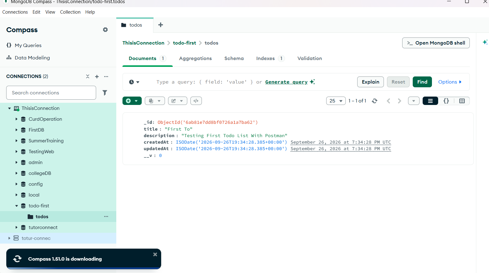
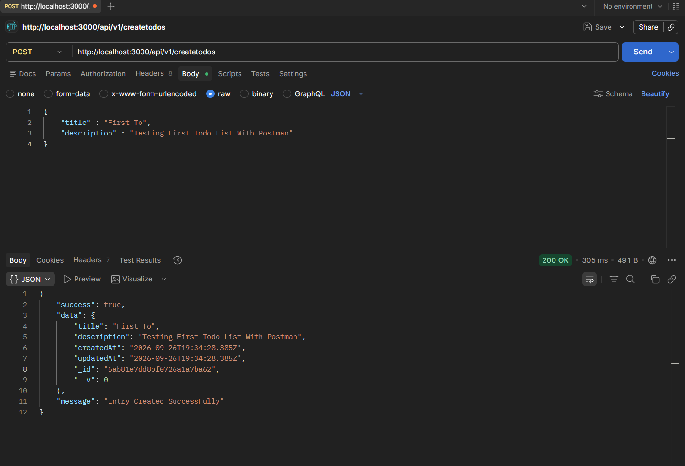

# Todo Backend

A beginner-friendly Express and MongoDB backend for creating todo entries. The project uses Express for the HTTP server, Mongoose for MongoDB communication, and dotenv for environment variables.

## Project Structure

```text
todo-first/
|-- config/
|   `-- database.js
|-- controllers/
|   `-- createToDo.js
|-- models/
|   `-- todo.js
|-- public/
|   |-- database.png
|   `-- postman-post.png
|-- routes/
|   `-- todos.js
|-- .env
|-- .gitignore
|-- index.js
|-- package.json
`-- package-lock.json
```

## Technologies

- Node.js
- Express 5
- MongoDB
- Mongoose
- dotenv

## Installation

1. Install Node.js and MongoDB access.
2. Install the project dependencies:

   ```bash
   npm install
   ```

3. Add the environment variables in `.env`:

   ```env
   PORT=4000
   DATABASE_URL=mongodb_connection_string_here
   ```

   `PORT` controls the server port. `DATABASE_URL` is the MongoDB connection string used by Mongoose.

4. Start the server:

   ```bash
   node index.js
   ```

   For development, the package script can be used with Nodemon when it is installed:

   ```bash
   npm run dev
   ```

The default server URL is `http://localhost:4000` unless another `PORT` is supplied.

## Application Entry Point: `index.js`

`index.js` is the main file of the backend. Its responsibilities are:

1. Create an Express application.
2. Load environment variables with `dotenv`.
3. Select the port from `process.env.PORT`, or use `4000` as a fallback.
4. Enable JSON request bodies with `express.json()`.
5. Mount the todo router at `/api/v1`.
6. Start the HTTP server.
7. Connect to MongoDB through `config/database.js`.
8. Respond to `GET /` with a simple server health message.

The route mounting means that a route written as `/createtodos` inside `routes/todos.js` becomes `/api/v1/createtodos` from a client’s point of view.

## Database Configuration: `config/database.js`

This file owns the MongoDB connection logic.

```js
mongoose.connect(process.env.DATABASE_URL)
```

`mongoose.connect()` receives the connection string from the `DATABASE_URL` environment variable. A successful connection prints a success message. A failed connection prints the error and exits the process with status `1`.

The connection function is exported so that `index.js` can call it when the application starts.

### Connection Flow

```text
index.js
   |
   | calls dbConnect()
   v
config/database.js
   |
   | reads DATABASE_URL
   v
MongoDB
```

## Model: `models/todo.js`

The model describes the shape of a todo document in MongoDB. It is created from a Mongoose schema and exported as the `ToDo` model.

| Field | Type | Purpose |
| --- | --- | --- |
| `title` | String | Todo title, intended to be required and limited to 50 characters |
| `description` | String | Todo details, intended to be required and limited to 50 characters |
| `createdAt` | Date | Creation time, defaults to `Date.now` |
| `updatedAt` | Date | Initial update time, defaults to `Date.now` |

Mongoose automatically adds an `_id` field to each document. The model name is `ToDo`; MongoDB will use its pluralized collection name, normally `todos`.

## Controller: `controllers/createToDo.js`

The controller contains the action performed when a client creates a todo.

### Request processing

1. Read `title` and `description` from `req.body`.
2. Pass those values to `Todo.create()`.
3. Save the new document in MongoDB.
4. Return the saved document in the JSON response.

The success response has this shape:

```json
{
  "success": true,
  "data": {
    "title": "Learn Express",
    "description": "Practice creating a POST route"
  },
  "message": "Entry Created SuccessFully"
}
```

If the database operation fails, the controller returns HTTP status `500` with an error message.

## Routes: `routes/todos.js`

The router imports the controller and connects it to the HTTP method and path:

```js
router.post("/createtodos", createToDo);
```

Because the router is mounted in `index.js` at `/api/v1`, the complete endpoint is:

```text
POST http://localhost:4000/api/v1/createtodos
```

### Create a Todo

Request headers:

```text
Content-Type: application/json
```

Request body:

```json
{
  "title": "Complete backend notes",
  "description": "Document the todo API"
}
```

Example with cURL:

```bash
curl -X POST http://localhost:4000/api/v1/createtodos ^
  -H "Content-Type: application/json" ^
  -d "{\"title\":\"Complete backend notes\",\"description\":\"Document the todo API\"}"
```

In PowerShell, the same request can be written as:

```powershell
$body = @{ title = "Complete backend notes"; description = "Document the todo API" } | ConvertTo-Json
Invoke-RestMethod -Method Post -Uri "http://localhost:4000/api/v1/createtodos" -ContentType "application/json" -Body $body
```

### Health Check

```text
GET http://localhost:4000/
```

Expected response:

```text
Server is Running Okay
```

## Public Images

The `public` directory stores reference images for learning and API testing. These files are not used by the Express API logic.

### Database diagram

Use [`public/database.png`](public/database.png) when studying the database or collection relationship shown in the project.



### Postman request example

Use [`public/postman-post.png`](public/postman-post.png) when learning how to configure the `POST` request in Postman. It shows the method, endpoint, request body, and response workflow to compare with your own test.



## Complete Request Flow

```text
Client/Postman
    |
    | POST /api/v1/createtodos
    v
index.js
    |
    | express.json() parses JSON
    v
routes/todos.js
    |
    | forwards request to createToDo
    v
controllers/createToDo.js
    |
    | calls Todo.create()
    v
models/todo.js
    |
    | Mongoose schema and model
    v
MongoDB
```

## Important Learning Notes

- The server must be connected to MongoDB before a todo can be created successfully.
- The request body must be valid JSON because the application uses `express.json()`.
- The API currently implements creation and health-check routes only. Read, update, and delete routes have not been added yet.
- Keep the MongoDB connection string private. Do not share it publicly or commit real credentials to a public repository.
- The schema currently uses `require`; Mongoose’s validation option is normally written as `required`. Update that option if you want missing `title` and `description` values to be rejected automatically.
- The error response currently refers to `response` even though that variable may not exist when an error occurs. This is a useful future cleanup: return `data: null` in the error response.

## Possible Next Features

1. Add `GET /api/v1/todos` to retrieve todos.
2. Add `GET /api/v1/todos/:id` to retrieve one todo.
3. Add `PUT` or `PATCH` to update a todo.
4. Add `DELETE` to remove a todo.
5. Add request validation and consistent error handling.
6. Add automated tests for the controller and routes.